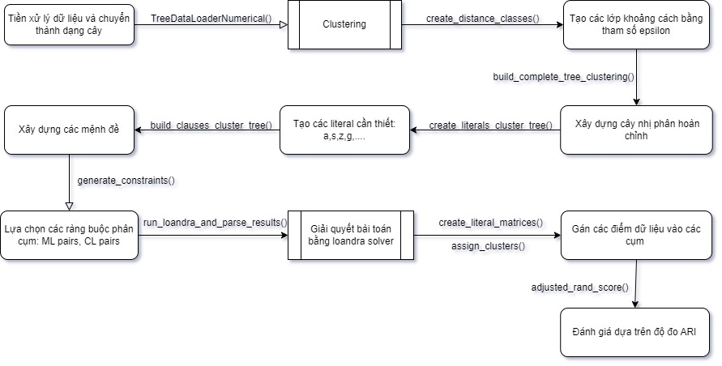

# Giải thích đoạn mã clustering sử dụng framework của SATreeCraft 
## Kiến trúc, quá trình của đoạn mã 

##File pipeline

## Giải thích hàm:
### Giải thích ý nghĩa của các hàm
- TreeDataLoaderBinaryNumerical():  Trả về các biến cần thiết cho việc clustering: true labels, features, dataset,...
- create_distance_classes(): Cho ra trận khoảng cách giữa các điểm và danh sách khoảng cách giữa các lớp
- build_complete_tree_clustering(): Cho ra cấu trúc của cây, danh sách các nút nhánh, nút lá.
- create_literals_cluster_tree(): Tạo các literal cần thiết cho bộ giải SAT
- build_clauses_cluster_tree(): xây dựng các mệnh đề cho bộ giải SAT
- generate_constraints(): Tạo ra các cặp ML, CL cho việc gom cụm.
- create_literal_matrices(): tạo các ma trận literal sau cùng
- assign_clusters(): Dùng các ma trận literal để gán nhãn các cụm cho bài toán.
- **Bài toán còn áp dụng thêm các phương pháp như Max Diameter (MD), Max Diameter - Min Split (MS-MD), clustering constraints (CC)** \
  bằng cách điều chỉnh các literal và mệnh đề. Chi tiết xem trong source code và bài báo.
  
### Giải thích các tham số truyền vào của hàm

## Kết quả cho ra
